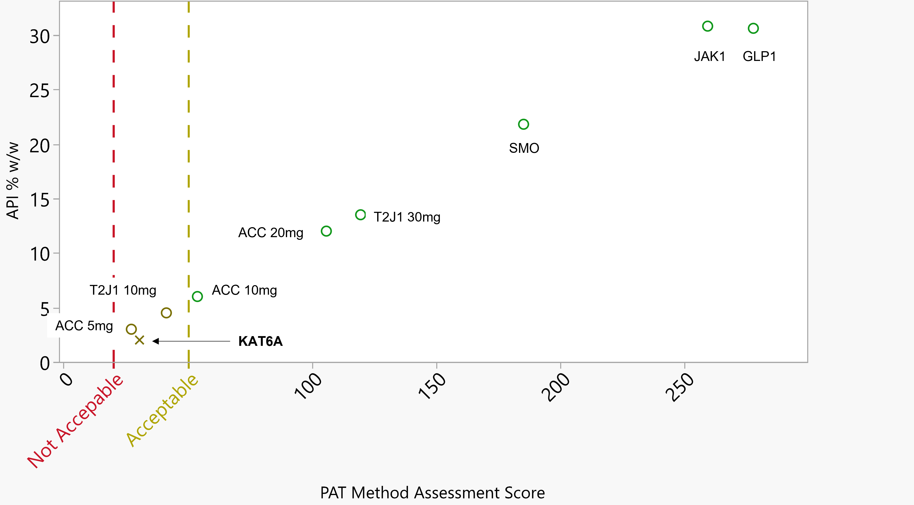

.. toctree::
   :maxdepth: 3

===========
Method
===========

A signal to noise vector represents the extent of spectral signal of the analyte of interest relative to the interference. For a PAT method quantifying API potency in the blend, the analyte signal corresponds to the API spectral signal and the interference corresponds to the spectral signal from all other components (excipients). The extent of the spectral signal from each component in the blend is a function of molar absorptivity (pure component spectrum) and the respective blend concentration of each component.

Riks esitmation
===========
The API signal to noise vector of the PAT method was calculated from the corresponding NIR spectrum and respective blend concentration using the formulation below,

Signal to Noise Vector = C^i x Pure Spectrum^i/ C x PURE
Where,
Signal to noise vectori is the signal to noise vector of API, considering API is the i’th component in the formulation,
Ci is the concentration of API,
Pure Spectrumi is the NIR spectrum of the API
C (vector) is the concentration of all components in blend
PURE (matrix) is the matrix of NIR spectra of all components in the blend

The signal to noise co-efficients are good indicators of the model performance since it carries information about the formulation as well as spectral uniqueness and interference. A baseline indicator was needed to compare model performance across different formulations, and then identify the relationship between model performance and PAT method score. Pure component modeling technique (CLS) was selected to compare model performance across different formulations since it provides equal weightage to each formulation in terms of model training (pure component data only). A figure of merit of the model is needed to evaluate and compare model performance. R square was selected considering the model will be primarily used for disturbance detection (Hybrid NIR-SS).

   PAT Method Portfolio Comparison

Model Performance
----------

.. automodule:: api
   :members:
   :private-members:
   :special-members:

   .. autodecorator:: app

``api.py``
^^^^^^^^^^

Dissocam module
---------------

.. automodule:: dissocam
   :members:
   :private-members:
   :special-members: __init__

``dissocam.py``
^^^^^^^^^^^^^^^

---------------

.. automodule:: helper_functions
   :members:
   :private-members:
   :special-members:

``helper_functions.py``
^^^^^^^^^^^^^^^^^^^^^^^
