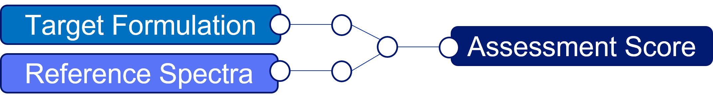
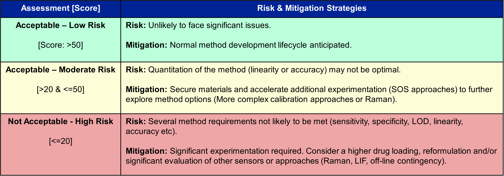

.. toctree::

Introduction
============

This PAT method assessment process evaluates the potential of the PAT method meeting all
quantitative validation requirements for blend potency on the PCMM platform. The assessment
is calculated based on the target blend formulation (drug loading) and spectral features of each formulation component.

   PAT Risk Assessment Tool

Based on the estimated risk, following risk categories have been definned to communicated and manage
risk. The details of the method is documented in the following experiment ref [1]

   PAT Risk Assessment Table

.. rubric:: Footnotes

.. [#f1] eLN 00711959-0044: PAT method risk assessment tool
